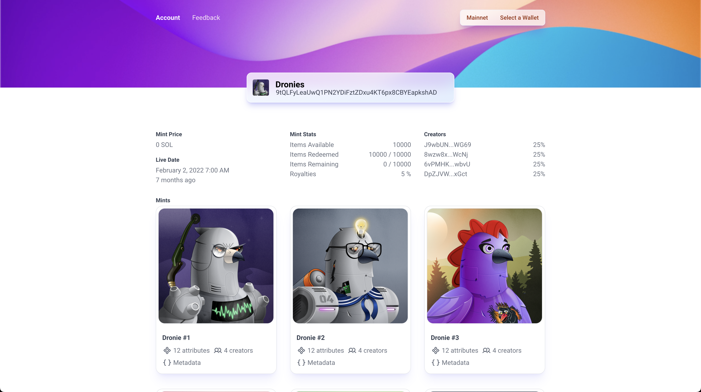

# Solanii (clone of Solaneyes.com)

This repo is an attempt at making a _basic_ clone of [Solaneyes](https://www.solaneyes.com/address/9tQLFyLeaUwQ1PN2YDiFztZDxu4KT6px8CBYEapkshAD).

View the clone at [www.solanii.com](https://www.solanii.com)! 👁

## Compare the two 👀

#### [Solaneyes Clone (www.solanii.com)](https://www.solanii.com/address/9tQLFyLeaUwQ1PN2YDiFztZDxu4KT6px8CBYEapkshAD)

#### [Solaneyes](https://www.solaneyes.com/address/9tQLFyLeaUwQ1PN2YDiFztZDxu4KT6px8CBYEapkshAD)

## Getting started 🔨

This is a create-react-app v5, so:

1. Clone the repo.
1. Install dependencies with either `yarn` or `npm install`.
1. Run the server locally with `yarn start` or `npm start`.
1. The app should now be running on [localhost:3000](http://localhost:3000)! Nice! 🚀

## Features that still need to be added 🙈

There is a lot of functionality that is missing that could be added:

1. Add mobile responsiveness (**only works on viewports of 1000px+ atm**).
1. Add tests (unit + e2e, I personally enjoy using jest/RTL + cypress/playwright).
1. When hovering over an NFT's actions (e.g. `12 attributes`, `4 creators`, `Metadata`), I have all the data to show that functionality but have not yet implemented it.
1. Ability to switch networks (should be pretty trivial adding additional context for `cluster`s and `metaplex` instances + adding ability in the header to change to a different cluster).
